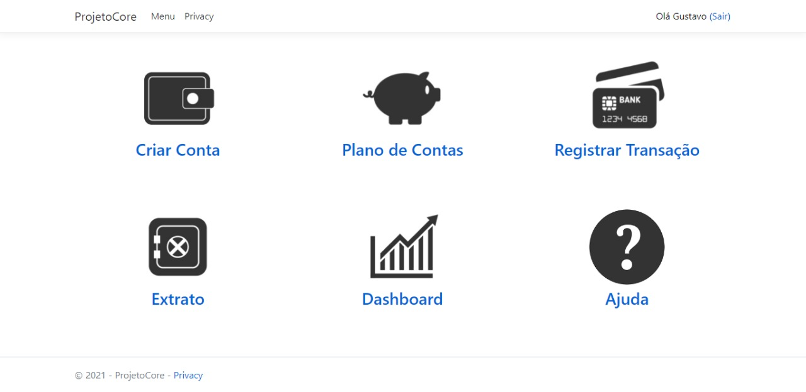
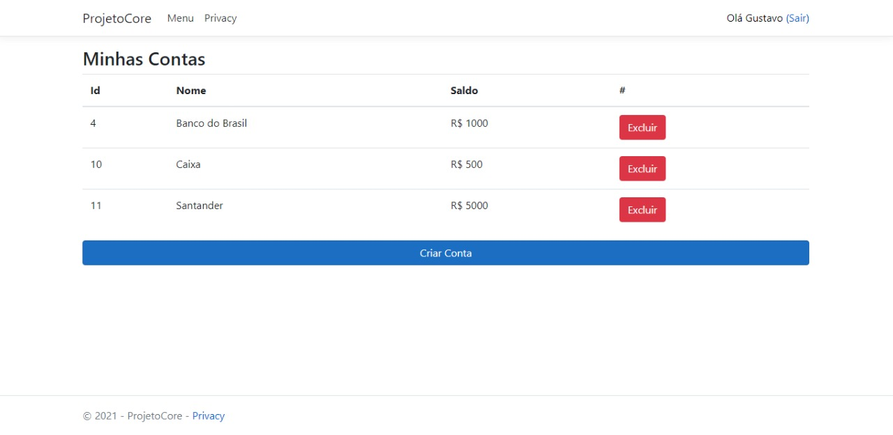

# Sistema Financeiro

<h3> Programa de sistema financeiro feito no curso de Asp.Net Core do Filipe Tório Lopes Ruas Nhimi. </h3> 

<h4 align="center"> Página de Login: </h4>

  

<h4 align="center"> Página de Registro: </h4>

  

<h4 align="center"> Página do Menu: </h4>

  
  <h4> Menu com as opções das Contas, do Plano de Contas, Transações, Extrato e do Dashborad. Cada um deles contém a página com as contas e com a opção de registro, como no exemplo abaixo... </h4>

<h4 align="center"> Página de Contas: </h4>

  

